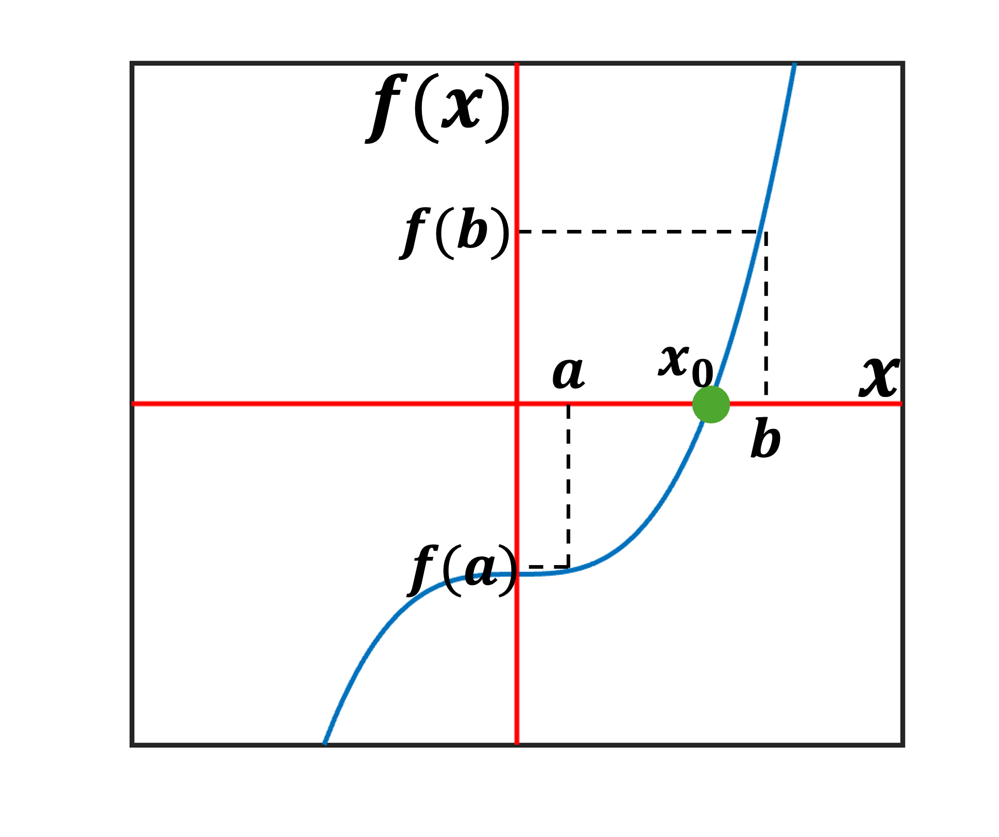
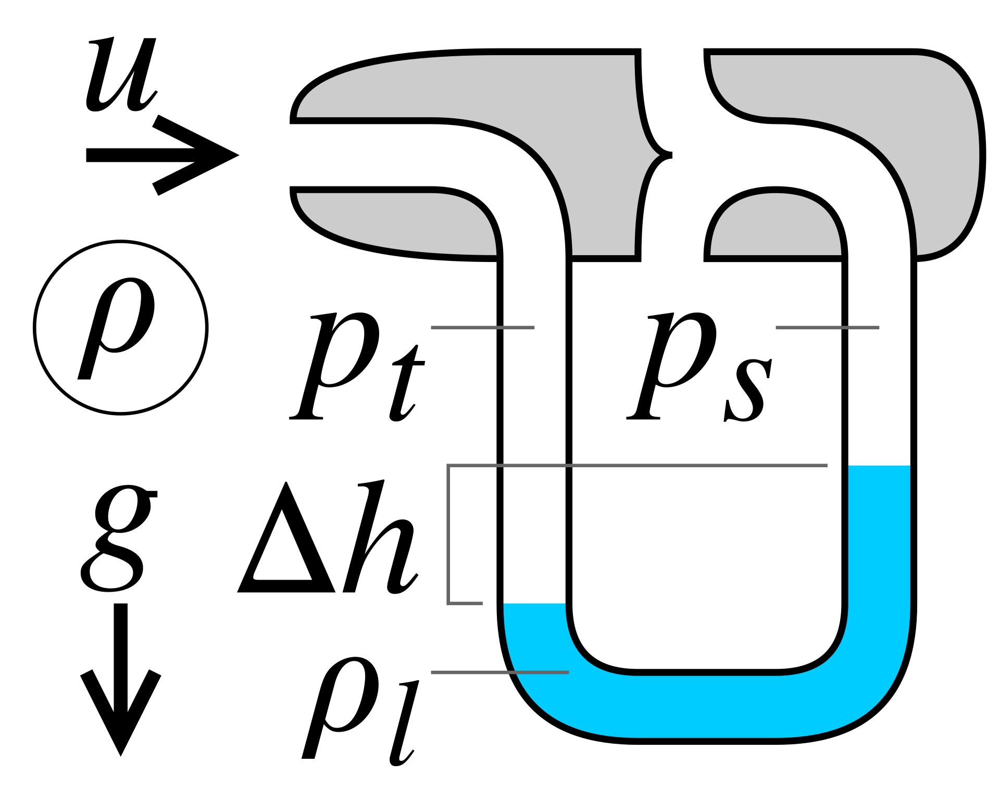
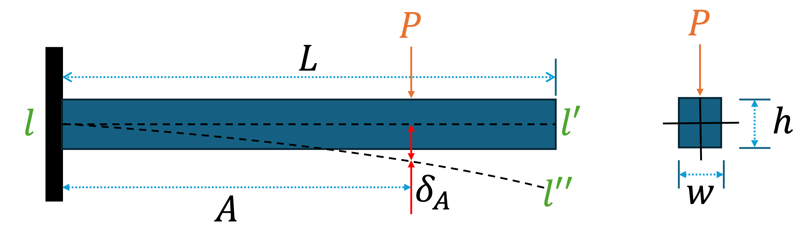

# Assignment # 1 Warm-up: Getting Started + Bisection Method
The purpose of this document is to demonstrate the functionality of the *bisection method* implemented in the file "bisection_method.py". Test cases are also provided in file "test_bisection.py" to check the code coverage and functioning of the bisection method function. A separate notebook "tutorial.ipynb" is also created to demonstrate the usage of bisection method function.
## Getting Started
User needs to ensure that following files are saved in the same folder (but not in Downloads) before running anything:
1. bisection_method.py
2. test_bisection.py
3. tutorials.ipynb

Another requirement for running these files is that it requires *numpy* package. If it is not already installed then user can run the following commands in the terminal to install *numpy* package by creating an environment (this is the recommended method according to NumPy website):
```python
conda create -n my-env
conda activate my-env
# If you want to install from conda-forge
conda config --env --add channels conda-forge
# The actual install command
conda install numpy
```
PIP users can install *numpy* package using the following command
```python
pip install numpy
```
For more information (or if you are not sure), then please visit [NumPy](https://numpy.org/install/) before running these commands.\
Once these requirements have been met then user can move to running tests or tutorials.\
**Note:** It is recommended that user goes through this README file before running tests or tutorial. The working and execution of different files will be explained in the subsequent sections. First let's understand how *bisection method* works.

## Bisection Method
It is a numerical technique which can be used to find a solution of a mathematical function within an interval provided that there exists only one root in the provided interval (It can be used to find multiple roots but it can only search for a single root in a go so if there are multiple roots, then it is advisable to reiterate the interval in a way so that only one root exists in it).
### How it works?
Let's say we have a function $f(x) = 0$ and it has one solution for $x\in[a, b]$. This means $f(x)$ crosses $x$ axis exactly once at $x = x_0$ in the interval $[a,b]$ as shown in the following figure (consider horizontal red line to be $x$-axis.). From this, it can be interpreted that $f(x_0) = 0$ where $x = x_0 \in [a,b]$.
<p align="center">
  
</p>
<p align="center">Figure 1: A function f(x) with exactly one root in the interval [a,b].</p>

Bisection method takes these intervals as a guess and seeks the solution $x_0$ iteratively within a defined tolerance ($\epsilon$).
### Algorithm
1. If $f(a) = 0$ (or $f(b) = 0$), then $a$ (or $b$) itself is a solution and bisection method should be able to return this result.
2. If $a$ or $b$ are not the solution then from the above figure, it can be said that $f(a)\cdot f(b) < 0$ given that there exists $x_0$ such that $f(x_0) = 0$. If this condition is not met then $x_0 \notin (a,b)$ and a new interval should be provided.
3. When $f(a)\cdot f(b)<0$, then bisection method calculates $c = (a+b)/2$ and then calculates $f(c)$.
4. If $f(a)\cdot f(c)<0$, then bisection method updates the interval to $[a, b(=c)]$ otherwise it changes the interval to $[a(=c), b]$.
5. Step 3 and 4 are repeated until $|f(c)| < \epsilon$ or $|b - a| < \epsilon$. Then $x = c$ is assigned as the solution.

### Pros and Cons of Bisection method
#### Pros
1. Easy to implement as it does not involve any derivatives or complicated calculations.
2. Convergence is guaranteed as long as there exists only one root within the given interval.
#### Cons
1. Convergence can take too long.
2. Sometimes it is difficult to predict the interval within which the root exists.
3. Limited usefulness as it can find only single root within a given interval (if it exists).

## Description of Code
### *test_bisection.py*
This file runs a bunch of tests to check the functionality of the function "*bisection*" defined in "*bisection_method.py*" file.\
It is mandatory to have the "*bisection_method.py*" file to be located in the same folder as the test file (not in Downloads). To run the tests, user needs to install *pytest* library. To install *pytest* enter the following command in the terminal.
```python
pip install -U pytest
```
User can verify the installation by running the following command:
```python
pytest --version
```
Once the above requirements are met, user can run the tests by using the following command in the terminal:
```python
pytest test_bisection.py
```
For more information, please visit [pytest](https://docs.pytest.org/en/stable/).

Following 9 test cases have been written for a single function $f(x) = x^3 -27$ whose only real root is at $x = 3$:

```python
'''
import pytest and the bisection_method file
'''
import pytest
from bisection_method import *
'''
In python, a function of a varibale can be defined using "lambda" keyword. The syntax of defining f(x) = expression is:
    f = lambda x: expression
'''
f = lambda x: x**3 - 27 # function with a known real root i.e., 3.
```

1. Finding a known root of an equation.
```python
def test_for_calculating_root():
    root = bisection(f, 2, 4, tol = 1e-6, max_iter = 100)
    assert abs(root - 3) < 1e-6
```
2. Finding the known root when the upper limit of the interval is farther away.
```python
def test_for_farther_upper_limit():
    root = bisection(f, 2, 100, tol = 1e-6, max_iter = 100)
    assert abs(root - 3) < 1e-6
```
3. Finding the known root when the lower limit of the interval is farther away.
```python
def test_for_farther_lower_limit():
    root = bisection(f, -100, 4, tol = 1e-6, max_iter = 100)
    assert abs(root - 3) < 1e-6
```
4. Finding the known root when both limits are farther away.
```python
def test_for_farther_limits():
    root = bisection(f, -100, 100, tol = 1e-6, max_iter = 100)
    assert abs(root - 3) < 1e-6
```
5. Test for if the limits have been entered in the correct manner i.e., $a < b$. In this test, limits are intentionally reversed to check if the error message is raised or not. This test passes if the ValueError message is raised.
```python
def test_for_correct_limits():
    with pytest.raises(ValueError, match = "a should be smaller than b."):
        bisection(f, 4, 2, tol = 1e-6, max_iter = 100)
```
6. Test for if $f(a)$ and $f(b)$ has different signs for the given $a$ and $b$. This test passes only if ValueError message is raised.
```python
def test_for_root_outside_the_limits():
    with pytest.raises(ValueError, match = "The values of the function at a and b should have different signs. Try changing the limits"):
        bisection(f, 4, 6, tol = 1e-6, max_iter = 100)
```
7. Test for if $a$ itself is the solution.
```python
def test_for_lower_limit_as_a_root_itself():
    root = bisection(f, 3, 4, tol = 1e-6, max_iter = 100)
    assert abs(root - 3) < 1e-6
```
8. Test for if $b$ itself is the solution.
```python
def test_for_upper_limit_as_a_root_itself():
    root = bisection(f, 2, 3, tol = 1e-6, max_iter = 100)
    assert abs(root - 3) < 1e-6
```
9. Test for convergence. This test is intentionally designed in such a way that the convergence criterion is not met. This test passes only if RuntimeError message is raised.
```python
def test_for_convergence():
    with pytest.raises(RuntimeError, match = "Convergence is taking too long. Try increasing the tolerance or increasing the maximum number of iterations allowed."):
        bisection(f, -100, 100, tol = 1e-16, max_iter = 10)
```
User can also check the code coverage report by installing the *pytest-cov* plugin from using the following command in the terminal:
```python
pip install pytest-cov
```
Once it is installed, code coverage can be checked by running the following command in the terminal:
```python
pytest --cov=bisection_method test_bisection.py
```
User can also generate code coverage report in html format by running the following command in the terminal:
```python
pytest --cov=bisection_method test_bisection.py --cov-report=html
```
For more information, please visit [pytest-cov](https://pypi.org/project/pytest-cov/).\
**Note:** User is encouraged to play around with different parameters to check which tests are failing by changing things.
### *bisection_method.py*
This file contains a single function *bisection* which implements the bisection method.\
*bisection* function can be called using the following syntax:
```python
root = bisection(f, a, b, tol, max_iter)
```
The above syntax calculates the root of function f (expression) within the interval [a, b] (both float, a < b). This function also takes tolerance as an input which the fourth input argument (float greater than 0). max_iter is the final input argument which is the maximum number of iteration users wants to allow before changing the parameters for convergence. The structure of the function is similar to the algorithm described in previous sections. The description of *bisection_method.py* is not provided here because it contains single function named *bisection* which takes 5 input parameters as it might become a bit confusing if it is broken into smaller chunks for the explanation purpose. The file *bisection_method.py* has been formatted and comments have been added in a way that it will be more than sufficient to go through the python file without changing things.\
**Note:** Help from ChatGPT was taken for understanding and implementing different error messages.
### *tutorials.ipynb*
This notebook contains 5 tutorial examples to demonstrate the functionality of the *bisection* function coded in the file *bisection_method.py*.\
First we import the *bisection_method* file and *numpy* package using the following code:
```python
from bisection_method import *
import numpy as np
```
Once this code block is run, we can move to the tutorial examples.\
**Note:** Code blocks for running the tutorial examples are not provided in this README file as they should be quite self explanatory in the notebook itself. Description of tutorial examples is provided in the following subsections.
#### Example 1: Root of $f(x) = \sin{x}$ in the interval $[\pi/2$, $3\pi/2]$
This example demonstrate the functioning of the bisection method function by seeking a solution of $\sin{x} = 0$ in $[\pi/2, 3\pi/2]$. It is known that the solution should be close to $x = \pi (\approx 3.14)$.
#### Example 2: Fixed point of a first order ordinary differential equation
Fixed point of a differential equation let's say $\dot{x} = f(x)$ is the point where $f(x) = 0$. It means that it is the where derivative of the function is zero. Please note that here we are talking about $x = x(t)$ as a function itself (not to be confused with $f(x)$). It is the point where function stops either increasing or decreasing. It is sometimes reffered to as a [stationary point](https://en.wikipedia.org/wiki/Stationary_point).\
The stationary point for $\dot{x} = f(x)$ can be calculated by taking $f(x) = 0$ and then finding its roots.\
Second example demonstrate how we can use bisection method to calculate a fixed point of a first order ordinary differential equation $\dot{y} = y^2 -25y + 100$ for $y \in [10,100]$.
#### Example 3: Population dynamics
This example demonstrate the usefulness of fixed point calculation by considering a very popular equation that is used to model population growth i.e., [logistic equation](https://brilliant.org/wiki/logistic-differential-equations/). It looks like:
$$\frac{\mathrm{d}N}{\mathrm{d}t} = rN\left(1-\frac{N}{K}\right)$$
where, $N$ is the population, $r$ is the intrinsic growth rate and $K$ is the carrying capacity of the environment. Here $\frac{\mathrm{d}N}{\mathrm{d}t} = \dot{N}$ represent the rate of change of population with time.\
Since most of the population models (including logistic equation) are really hard to solve, so researchers usually seek the fixed points to at least make a prediction about what will be the population when it reaches equilibrium.\
This tutorial example demonstrates how we can calculate the fixed point of the logistic equation for given parameters by making a proper guess about the interval.
#### Example 4: (Mechanics) Measuring fluid velocity in a pipe using a pitot tube
Pitot tube is a device that is used to measure the velocity of an incompressible fluid in a pipe using the Bernoulli's principle. Bernoulli's equation along a streamline for a fluid flowing between point $m$ and $n$ is given as:
$$P_m + \frac{1}{2}\rho V_m^2 + \rho g z_m = P_n + \frac{1}{2}\rho V_n^2 + \rho g z_n$$
where, $P$ represent pressure, $\rho$ represents density, $V$ is velocity, $g$ is acceleation due to gravity and $z$ is the height from a datum. The subscripts $m$ and $n$ refer to the parameters at point $m$ and $n$ respectively.\
For a horizontal pipe, $z_m = z_n$. Now, pitot tube works in such a way that it can be used to at least find the difference between the stagnation pressure (where velocity is $0$) and the static pressure (pressure in flowing fluid).
<p align="center">
  
</p>
<p align="center">Figure 2: Principle of working of a pitot tube using a manometer.</p>

Let's represent stagnationation pressure by $p_t$ and static pressure by $p_s$ as shown in Figure 2. At the point where we are measuring the static pressure, the velocity will be zero and let's say the velocity where we are measuring the static pressure is $u$, then Bernoulli's equation reduces to:
$$p_t = p_s + \frac{\rho u^2}{2}$$
Now, we can try to calculate the velocity using bisection method for a given set of parameters.\
**Note:** Figure 2 was downloaded from [here](https://en.wikipedia.org/wiki/Pitot_tube#/media/File:Pitot_tube_manometer.svg). For more information about pitot tube, please visit [Wikipedia](https://en.wikipedia.org/wiki/Pitot_tube#).
#### Example 5: (Mechanics) Deflection of a rectangular cantilever beam due to concentrated load.
Let's take a cantilever beam of length $L$, and let's say that a load $P$ is acting vertically (through neutral axis) at a distance $A$ from the fixed end. Then the deflection at that point (see Figure 3 in which the neutral axis $l-l'$ is deforming to $l-l''$ as described) can be calculated as:
$$\delta_{A} = \frac{PA^2(3L - A)}{6EI}$$
where, $E$ is the Young's modulus of the beam and $I$ is the second moment of area along the axis that is perpendicular to the direction in which load is applied. For a rectangular beam with width $w$ and height $h$, $I$ can be calculated as:
$$I = \frac{wh^3}{12}$$
<p align="center">
  
</p>
<p align="center">Figure 3: A cantilever beam undergoing deformation due to a point load.</p>

The implementation of this example in the notebook shows that how we can calculate the distance $A$ using bisection method if other parameters are given. It has to be noted that the limits on the interval cannot be outside $[0, L]$. If bisection method is giving a result which lies either outside this or it is not converging then there might have been a mistake while selecting appropriate parameters. For more information about cantilever or other beams, please visit [Wikipedia](https://en.wikipedia.org/wiki/Deflection_(engineering)).

## Final remarks for the user
User is encouraged to play with different parameters in *test_bisection.py* and *tutorials.ipynb* notebook to check how the script *bisection_method.py* works under different scenarios.
